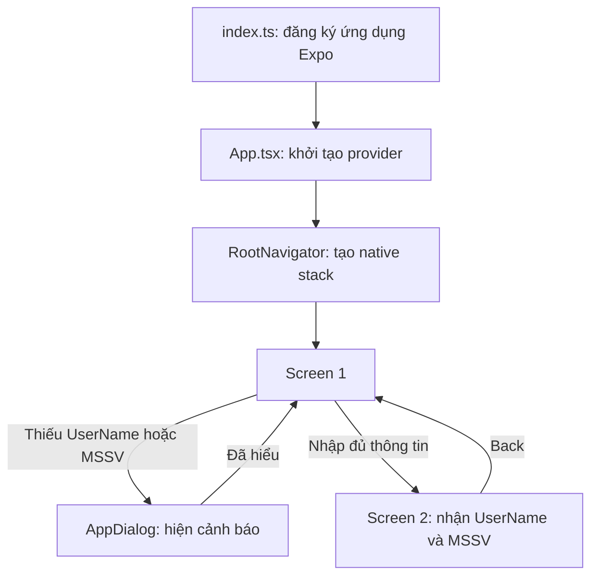

# Giải thích code — Bài tập buổi 3

> Tài liệu này mô tả code đang có trong dự án React Native/Expo. Các số dòng giúp tìm nhanh; số dòng có thể thay đổi nếu code được sửa.

## 1. Ứng dụng làm gì?

Ứng dụng có hai màn hình:

- **Screen 1:** hiển thị sáu ô màu và hai ô nhập `UserName`, `MSSV`.
- Nhấn **Click me** khi còn thiếu thông tin sẽ mở hộp thoại cảnh báo.
- Nhập đủ thông tin rồi nhấn **Click me** sẽ chuyển sang Screen 2 và truyền dữ liệu đã nhập.
- **Screen 2:** hiển thị tên, MSSV và nút **Back** để quay lại Screen 1.

## 2. Cấu trúc thư mục

```text
App.tsx
index.ts
src/
  components/
    AppButton.tsx       # Nút Click me, Back và nút đóng hộp thoại
    AppDialog.tsx       # Hộp thoại báo thiếu thông tin
    ColorTile.tsx       # Một ô số có màu nền
    ColorTileGrid.tsx   # Sắp xếp sáu ô màu
    FormField.tsx       # Ô nhập có thể tái sử dụng
  navigation/
    RootNavigator.tsx  # Khai báo các màn hình và cách chuyển màn hình
  screens/
    Screen1.tsx         # Form nhập, kiểm tra dữ liệu
    Screen2.tsx         # Hiển thị thông tin sinh viên
  theme/
    colors.ts           # Màu dùng chung
  types/
    navigation.ts       # Kiểu dữ liệu sinh viên và tham số route
```

## 3. Luồng khởi động và điều hướng



### `index.ts` — điểm bắt đầu

`index.ts` gọi `registerRootComponent(App)` để đăng ký component gốc cho Expo. Expo bắt đầu chạy ứng dụng từ đây. [Mở file](index.ts#L1-L5)

### `App.tsx` — component gốc

`App` bọc ứng dụng bằng `SafeAreaProvider` để các màn hình có thể tính vùng an toàn quanh tai thỏ/thanh trạng thái. `RootNavigator` bên trong quản lý hai màn hình. [Mở file](App.tsx#L1-L13)

### `RootNavigator.tsx` — ngăn xếp màn hình

`createNativeStackNavigator<RootStackParamList>()` tạo một **native stack**: mỗi màn hình được đưa vào ngăn xếp. `headerShown: false` ẩn thanh tiêu đề mặc định để ứng dụng tự vẽ nút Back theo mẫu. [Mở file](src/navigation/RootNavigator.tsx#L1-L26)

## 4. Truyền dữ liệu giữa hai màn hình

### Kiểu dữ liệu

Trong `src/types/navigation.ts`, `Student` định nghĩa dữ liệu sinh viên gồm hai chuỗi `userName` và `mssv`. `RootStackParamList` khai báo Screen 1 không nhận tham số, còn Screen 2 nhận một `Student`. Nhờ đó TypeScript báo lỗi nếu truyền thiếu hoặc sai kiểu dữ liệu. [Mở file](src/types/navigation.ts#L1-L9)

### Screen 1: nhận và kiểm tra thông tin

`Screen1` lưu nội dung hai ô nhập trong React **state** bằng `useState`. Khi người dùng gõ, `FormField` gọi `onChangeText`, còn `setUserName` hoặc `setMssv` cập nhật state. [Mở file](src/screens/Screen1.tsx#L22-L25)

Khi nhấn **Click me**, hàm `submitStudentInfo` thực hiện các bước:

1. Gọi `trim()` để bỏ khoảng trắng ở đầu và cuối.
2. Tìm trường nào còn trống.
3. Nếu thiếu dữ liệu, đặt nội dung cảnh báo vào `dialogMessage` rồi dừng bằng `return`.
4. Nếu đủ dữ liệu, gọi `navigation.navigate('Screen2', student)` để mở Screen 2 và gửi object `student` làm route params.

Đoạn xử lý nằm ở [Screen1.tsx](src/screens/Screen1.tsx#L27-L38). Ví dụ object được gửi:

```ts
{
  userName: 'Đỗ Tuấn Anh',
  mssv: 'BIT240015',
}
```

### Screen 2: đọc dữ liệu và quay lại

`Screen2` lấy thông tin qua `route.params`, sau đó hiển thị tên và MSSV. Nút **Back** gọi `navigation.goBack()` để bỏ Screen 2 khỏi ngăn xếp và quay lại Screen 1. [Mở file](src/screens/Screen2.tsx#L9-L30)

## 5. Hộp thoại kiểm tra dữ liệu

`AppDialog` dùng component `Modal` để phủ hộp thoại lên màn hình hiện tại. Các props điều khiển nội dung và trạng thái gồm:

- `visible`: hộp thoại có đang mở không.
- `title`: tiêu đề, ví dụ “Thiếu thông tin”.
- `message`: trường còn thiếu, ví dụ “Vui lòng nhập UserName và MSSV.”.
- `onClose`: hàm đóng hộp thoại khi nhấn **Đã hiểu** hoặc nút Back phần cứng trên Android.

`Screen1` chỉ mở hộp thoại khi phát hiện trường trống; đóng hộp thoại không xóa nội dung đã nhập. [AppDialog.tsx](src/components/AppDialog.tsx#L1-L29) · [cách dùng trong Screen 1](src/screens/Screen1.tsx#L79-L84)

## 6. Các component giao diện dùng chung

### `AppButton.tsx`

Nhận `title`, `onPress` và `variant`. `variant="primary"` dùng cho nút **Click me** và **Đã hiểu**; `variant="back"` dùng cho nút **Back** màu cam. Một component có thể được tái sử dụng ở nhiều màn hình. [Mở file](src/components/AppButton.tsx#L1-L62)

### `FormField.tsx`

Đóng gói một ô `TextInput`. Màn hình truyền vào nhãn trợ năng, placeholder, giá trị hiện tại và hàm xử lý khi nội dung đổi. Vì vậy, Screen 1 không cần viết lại cùng một nhóm thuộc tính cho cả hai ô nhập. [Mở file](src/components/FormField.tsx#L1-L53)

### `ColorTile.tsx` và `ColorTileGrid.tsx`

`ColorTile` chỉ chịu trách nhiệm vẽ một ô: nhận số, màu nền và tuỳ chọn chữ tối. `ColorTileGrid` tạo sáu ô, sắp xếp theo hàng và điều chỉnh kích thước theo màn hình. Ô 3 và 4 có `flex: 1`, ô 5 có `flex: 2`, vì vậy ô 5 rộng gấp đôi mỗi ô bên cạnh. [ColorTile](src/components/ColorTile.tsx#L1-L32) · [ColorTileGrid](src/components/ColorTileGrid.tsx#L1-L44)

### `colors.ts`

Lưu màu dùng chung trong một nơi. Ví dụ nút, chữ và viền cùng dùng các giá trị từ `colors`, giúp giao diện nhất quán và dễ đổi màu. [Mở file](src/theme/colors.ts#L1-L17)

## 7. Một số khái niệm trong code

- **Component:** một phần giao diện có thể tái sử dụng, như `FormField` hoặc `AppButton`.
- **Props:** dữ liệu/hành vi component cha truyền xuống component con.
- **State:** dữ liệu thay đổi khi người dùng thao tác; ở đây là nội dung hai ô nhập và thông báo lỗi.
- **Route params:** dữ liệu gửi kèm lúc chuyển màn hình.
- **StyleSheet:** nơi khai báo style React Native theo từng component.
- **`flex`:** chia không gian còn lại giữa các thành phần trong hàng/cột.

## 8. Chạy ứng dụng

Trong thư mục dự án:

```bash
npm install
npm run web
```

Hoặc chạy trên Android với `npm run android`.
